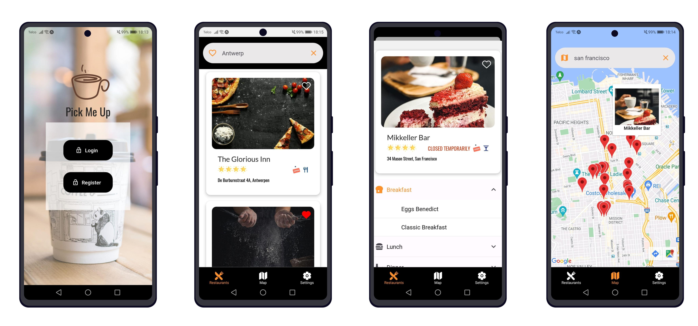

# Pick Me Up



**Coffee Shop & Restaurant Finder**

This is a mobile app created using React Native to help users find coffee shops and restaurants in their area. The app is designed to use the Google Places API to search for businesses and display information like ratings, opening hours, and menus.

## Features

- Search for nearby coffee shops and restaurants
- View detailed information about businesses, including opening hours, ratings, and menus
- Bookmark favourite businesses for easy access later
- View business locations on Google Maps  

  
## Live Preview

To preview this app, you will need to have the [Expo client](https://expo.dev/) installed on your mobile device or in an emulator. With the client you can either scan the QR code or copy the link from the project page: https://expo.dev/@schlenges/PickMeUp 

Data used to register will temporarily be stored through Firebase. 
Alternatively, you can use a test account with the credentials
```
  email: test@mail.com
  password: test123
```

Since the app is currently only being populated by mock data, the search will only display results for ```Chicago```, ```San Francisco```, ```Antwerp``` and ```Toronto```.

## Credits

The coffee-to-go cup icon is by <a href="https://www.flaticon.com/free-icons/coffee" title="coffee icons">justicon via Flaticon</a>.
